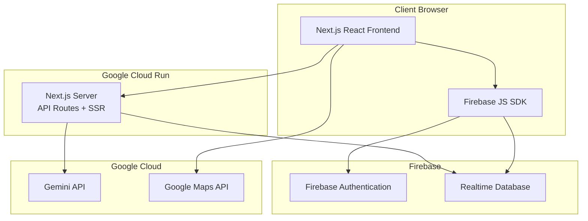
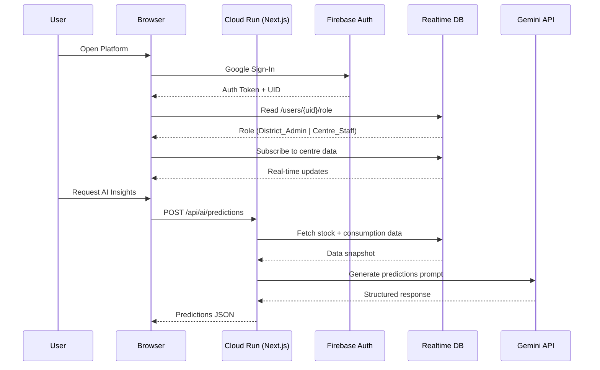
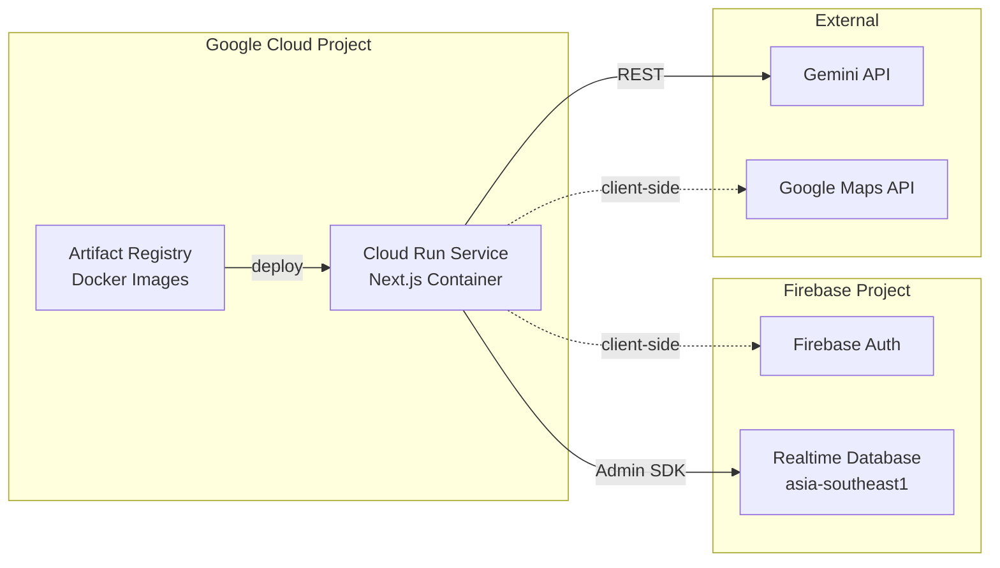

# Design Document: Smart Health AI Platform

## Overview

The Smart Health AI Platform is a full-stack web application deployed as a single containerized service on Google Cloud Run. It provides district-level health administrators and centre staff with real-time monitoring, AI-powered insights, and multilingual support for managing PHCs and CHCs across Indian districts.

### Technology Stack

| Layer | Technology | Rationale |
|-------|-----------|-----------|
| Frontend | Next.js 15 (App Router) with React 19, TypeScript | SSR + SPA hybrid; single deployment unit with backend API routes; strong typing |
| Backend | Next.js API Routes (Route Handlers) | Co-located with frontend; no separate server needed; runs on Cloud Run |
| Database | Firebase Realtime Database | Real-time sync for live dashboard updates; offline support; low-latency writes |
| Authentication | Firebase Authentication (Google Sign-In) | Native integration with Firebase RTDB; role-based access via custom claims or profile data |
| AI/ML | Google Gemini API (via `@google/generative-ai` SDK) | Multilingual text generation; structured JSON output for predictions and recommendations |
| Maps | Google Maps JavaScript API | District-level centre location visualization |
| Analytics | BigQuery (future phase) | Aggregated reporting and long-term trend analysis |
| Deployment | Google Cloud Run | Serverless auto-scaling; single container serves frontend + API; cost-effective for MVP |
| Styling | Tailwind CSS | Utility-first CSS; rapid prototyping; responsive design |
| Charts | Chart.js via react-chartjs-2 | Lightweight charting for footfall bar charts and stock visualizations |
| i18n | next-intl | Type-safe internationalization with server component support |

### Key Design Decisions

1. **Single Cloud Run service**: Frontend and API routes are co-deployed in one Next.js container, simplifying deployment and meeting Requirement 11.
2. **Firebase Realtime Database over Firestore**: The requirements explicitly specify Realtime_DB for live synchronization. RTDB provides lower latency for simple JSON data models used in this MVP.
3. **Gemini API (direct) over Vertex AI SDK**: For an MVP/hackathon, the `@google/generative-ai` SDK provides simpler integration than the full Vertex AI platform SDK while still accessing Gemini models.
4. **Role stored in RTDB user profile**: Roles (District_Admin, Centre_Staff) are stored in `/users/{uid}/role` in Realtime DB, read on auth to determine access level.

## Architecture

### System Architecture Diagram



### Data Flow



### Deployment Architecture



## Components and Interfaces

### Frontend Components

#### 1. Authentication Module (`/app/(auth)/`)

| Component | Responsibility |
|-----------|---------------|
| `LoginPage` | Renders Google Sign-In button; handles auth flow |
| `AuthProvider` | React context providing auth state, user role, loading status |
| `AuthGuard` | HOC/middleware redirecting unauthenticated users to login |
| `RoleGuard` | Restricts page access based on user role |

#### 2. Dashboard Module (`/app/(dashboard)/`)

| Component | Responsibility |
|-----------|---------------|
| `DistrictDashboard` | Summary cards for all centres; district map; aggregated stats |
| `CentreCard` | Individual centre summary with colour-coded indicators |
| `DistrictMap` | Google Maps integration showing centre locations |
| `AlertBanner` | Displays stock-low, full-capacity, and understaffing alerts |
| `UnderperformingIndicator` | Red flag with metric breach summary |

#### 3. Centre Detail Module (`/app/(dashboard)/centre/[id]/`)

| Component | Responsibility |
|-----------|---------------|
| `CentreDetailPage` | Detailed view of a single Health Centre |
| `StockTable` | Medicine inventory list with colour-coded status |
| `StockEditForm` | Inline editing of medicine quantities |
| `FootfallChart` | 7-day bar chart of patient footfall |
| `FootfallInputForm` | Daily patient count input |
| `BedAvailabilityPanel` | Total/available beds display and update |
| `DoctorAttendancePanel` | Present/assigned doctors display and update |

#### 4. AI Insights Module (`/app/(dashboard)/insights/`)

| Component | Responsibility |
|-----------|---------------|
| `PredictionsPanel` | Displays stock-out predictions ranked by urgency |
| `RedistributionPanel` | Displays resource transfer recommendations |
| `AILoadingState` | Loading indicator during Gemini API calls (up to 30s) |
| `AIErrorState` | Error handling for unavailable AI service |

#### 5. Language Module

| Component | Responsibility |
|-----------|---------------|
| `LanguageSwitcher` | Dropdown to select English/Hindi |
| `IntlProvider` | Wraps app with selected locale context |

### Backend API Routes (`/app/api/`)

| Route | Method | Responsibility |
|-------|--------|---------------|
| `/api/ai/predictions` | POST | Fetch stock data, call Gemini for stock-out predictions |
| `/api/ai/redistribution` | POST | Fetch multi-centre data, call Gemini for redistribution recs |
| `/api/ai/evaluate-centres` | POST | Evaluate centres for underperformance flags |
| `/api/health` | GET | Health check endpoint for Cloud Run |

### Service Layer (`/lib/services/`)

| Service | Responsibility |
|---------|---------------|
| `FirebaseAdminService` | Server-side Firebase Admin SDK initialization; RTDB reads |
| `GeminiService` | Gemini API client; prompt construction; response parsing |
| `StockAnalysisService` | Business logic for stock level analysis and thresholds |
| `AlertService` | Computes alert conditions (stock-low, full-capacity, understaffed) |
| `ValidationService` | Input validation for all data entry forms |
| `LocaleService` | Language preference persistence and retrieval |

### Interfaces

```typescript
// Core data models referenced across components
interface HealthCentre {
  id: string;
  name: string;
  districtId: string;
  location: { lat: number; lng: number };
  totalBeds: number;
  assignedDoctors: number;
  maxPatientCapacity: number;
}

interface MedicineStock {
  medicineId: string;
  name: string;
  quantity: number;       // 0-999999, whole number
  reorderLevel: number;
  expiryDate: string;     // ISO 8601 date
  centreId: string;
}

interface PatientFootfall {
  date: string;           // YYYY-MM-DD
  centreId: string;
  count: number;          // 0-10000, integer
}

interface DoctorAttendance {
  date: string;           // YYYY-MM-DD
  centreId: string;
  presentCount: number;
}

interface StockPrediction {
  centreId: string;
  centreName: string;
  medicineId: string;
  medicineName: string;
  currentQuantity: number;
  predictedStockOutDate: string; // ISO 8601 date
}

interface RedistributionRecommendation {
  sourceCentreId: string;
  sourceCentreName: string;
  destinationCentreId: string;
  destinationCentreName: string;
  resourceType: 'medicine' | 'staff' | 'beds';
  resourceName?: string;
  quantity: number;
  explanation: string;   // max 500 chars
}

interface UserProfile {
  uid: string;
  email: string;
  role?: 'District_Admin' | 'Centre_Staff';
  districtId?: string;
  centreId?: string;      // For Centre_Staff
  languagePreference: 'en' | 'hi';
}
```

## Data Models

### Firebase Realtime Database Schema

```
/
├── users/
│   └── {uid}/
│       ├── email: string
│       ├── role: "District_Admin" | "Centre_Staff"
│       ├── districtId: string
│       ├── centreId: string (Centre_Staff only)
│       └── languagePreference: "en" | "hi"
│
├── districts/
│   └── {districtId}/
│       ├── name: string
│       └── centres/
│           └── {centreId}: true (index)
│
├── centres/
│   └── {centreId}/
│       ├── name: string
│       ├── districtId: string
│       ├── location/
│       │   ├── lat: number
│       │   └── lng: number
│       ├── totalBeds: number
│       ├── availableBeds: number
│       ├── assignedDoctors: number
│       └── maxPatientCapacity: number
│
├── medicines/
│   └── {centreId}/
│       └── {medicineId}/
│           ├── name: string
│           ├── quantity: number
│           ├── reorderLevel: number
│           └── expiryDate: string
│
├── footfall/
│   └── {centreId}/
│       └── {date}/              (YYYY-MM-DD)
│           └── count: number
│
├── attendance/
│   └── {centreId}/
│       └── {date}/              (YYYY-MM-DD)
│           └── presentCount: number
│
└── alerts/
    └── {districtId}/
        └── {alertId}/
            ├── type: "stock_low" | "full_capacity" | "understaffed" | "underperforming"
            ├── centreId: string
            ├── message: string
            ├── metrics: object (threshold details)
            ├── createdAt: number (timestamp)
            └── resolved: boolean
```

### Security Rules (Firebase RTDB)

```json
{
  "rules": {
    "users": {
      "$uid": {
        ".read": "$uid === auth.uid",
        ".write": "$uid === auth.uid && !newData.hasChild('role')"
      }
    },
    "centres": {
      "$centreId": {
        ".read": "auth != null",
        ".write": "root.child('users').child(auth.uid).child('role').val() === 'Centre_Staff' && root.child('users').child(auth.uid).child('centreId').val() === $centreId"
      }
    },
    "medicines": {
      "$centreId": {
        ".read": "auth != null",
        ".write": "root.child('users').child(auth.uid).child('role').val() === 'Centre_Staff' && root.child('users').child(auth.uid).child('centreId').val() === $centreId"
      }
    },
    "footfall": {
      "$centreId": {
        ".read": "auth != null",
        ".write": "root.child('users').child(auth.uid).child('role').val() === 'Centre_Staff' && root.child('users').child(auth.uid).child('centreId').val() === $centreId"
      }
    },
    "attendance": {
      "$centreId": {
        ".read": "auth != null",
        ".write": "root.child('users').child(auth.uid).child('role').val() === 'Centre_Staff' && root.child('users').child(auth.uid).child('centreId').val() === $centreId"
      }
    }
  }
}
```

### Gemini API Prompt Structures

**Stock-Out Prediction Prompt:**
```
You are a health supply chain analyst. Analyze medicine stock data for district health centres.

Data: {JSON of stock levels and 30-day consumption history}

For each medicine below 30% of reorder level, predict the stock-out date based on consumption trends.

Respond in {language} with JSON:
{
  "predictions": [
    {
      "centreId": "...",
      "centreName": "...",
      "medicineId": "...",
      "medicineName": "...",
      "currentQuantity": N,
      "predictedStockOutDate": "YYYY-MM-DD",
      "confidence": "high|medium|low"
    }
  ],
  "insufficientData": [
    { "medicineId": "...", "medicineName": "...", "reason": "..." }
  ]
}
```

**Redistribution Recommendation Prompt:**
```
You are a district health resource optimizer. Analyze resource distribution across centres.

Data: {JSON of stock, footfall, bed occupancy for all centres}

Generate 1-10 transfer recommendations to balance resources. Each recommendation must have source, destination, resource type, quantity, and explanation (max 500 chars).

Respond in {language} with JSON:
{
  "recommendations": [
    {
      "sourceCentreId": "...",
      "sourceCentreName": "...",
      "destinationCentreId": "...",
      "destinationCentreName": "...",
      "resourceType": "medicine|staff|beds",
      "resourceName": "...",
      "quantity": N,
      "explanation": "..."
    }
  ]
}
```


## Correctness Properties

*A property is a characteristic or behavior that should hold true across all valid executions of a system — essentially, a formal statement about what the system should do. Properties serve as the bridge between human-readable specifications and machine-verifiable correctness guarantees.*

### Property 1: Medicine list alphabetical sort invariant

*For any* list of medicines belonging to a Health Centre, the Stock Monitor display function SHALL return them sorted alphabetically by medicine name, regardless of insertion order.

**Validates: Requirements 3.1**

### Property 2: Medicine quantity range validation

*For any* numeric input value, the medicine quantity validator SHALL accept it if and only if it is a whole number (integer) in the range [0, 999,999]. All other values (negative, decimal, exceeding 999,999, or non-numeric) SHALL be rejected.

**Validates: Requirements 3.2**

### Property 3: Stock colour-coding threshold correctness

*For any* medicine with a given quantity and reorder level (where reorderLevel > 0), the colour-coding function SHALL return:
- "green" when quantity > reorderLevel
- "yellow" when quantity <= reorderLevel AND quantity > reorderLevel * 0.5
- "red" when quantity <= reorderLevel * 0.5

**Validates: Requirements 3.5**

### Property 4: Stock-low alert trigger

*For any* medicine and its associated reorder level, the Alert System SHALL generate a stock-low alert if and only if the medicine's quantity is strictly below its reorder level.

**Validates: Requirements 3.4**

### Property 5: Patient footfall range validation

*For any* numeric input value, the patient footfall validator SHALL accept it if and only if it is an integer in the range [0, 10,000]. All other values SHALL be rejected.

**Validates: Requirements 4.1, 4.4**

### Property 6: Footfall upsert idempotency

*For any* sequence of patient footfall writes to the same (date, centreId) key, reading the stored value SHALL return the value of the most recent write, regardless of the number of previous writes.

**Validates: Requirements 4.2**

### Property 7: Seven-day footfall zero-fill

*For any* sparse set of footfall records within a 7-day window, the chart data transformation SHALL produce exactly 7 entries (one per day), with zero substituted for any day without a recorded value.

**Validates: Requirements 4.5**

### Property 8: Aggregate footfall sum

*For any* set of Health Centres with daily footfall values, the district-level aggregated footfall for a given day SHALL equal the arithmetic sum of all individual centre footfall values for that day.

**Validates: Requirements 4.6**

### Property 9: Bed availability range validation

*For any* bed availability update with a given totalBeds value, the validator SHALL accept the update if and only if the availableBeds value is an integer in the range [0, totalBeds]. Values that are negative or exceed totalBeds SHALL be rejected.

**Validates: Requirements 5.1, 5.3**

### Property 10: Full-capacity alert bidirectional

*For any* Health Centre, the full-capacity alert SHALL be present on the district Dashboard if and only if the centre's availableBeds equals zero. When availableBeds increases above zero, the alert SHALL be removed.

**Validates: Requirements 5.4, 5.5**

### Property 11: Doctor attendance range validation

*For any* doctor attendance submission with a given assignedDoctors value, the validator SHALL accept it if and only if the presentCount is an integer in the range [0, assignedDoctors].

**Validates: Requirements 6.4**

### Property 12: Understaffed alert threshold

*For any* Health Centre with assignedDoctors > 0 and a given presentCount, the Alert System SHALL flag the centre as understaffed if and only if presentCount < assignedDoctors * 0.5.

**Validates: Requirements 6.3**

### Property 13: Stock-out prediction filter

*For any* set of medicines across district Health Centres, the AI Engine's prediction filter SHALL select for analysis exactly those medicines whose current quantity is below 30% of their reorder level (quantity < reorderLevel * 0.3).

**Validates: Requirements 7.2**

### Property 14: Predictions urgency sort

*For any* list of stock-out predictions, the presentation layer SHALL sort them in ascending order by predictedStockOutDate (nearest date first).

**Validates: Requirements 7.3**

### Property 15: Insufficient consumption data flag

*For any* medicine, if the number of days with recorded consumption data in the last 30 days is fewer than 7, the AI Engine SHALL flag that medicine as having insufficient historical data and exclude it from prediction generation.

**Validates: Requirements 7.4**

### Property 16: Gemini response structure validation

*For any* Gemini API response for redistribution recommendations, the response validator SHALL accept it if and only if it contains between 1 and 10 recommendations (inclusive), and each recommendation's explanation field is at most 500 characters in length.

**Validates: Requirements 8.2, 8.3**

### Property 17: Redistribution data sufficiency check

*For any* set of Health Centres in a district, the Resource Optimizer SHALL determine that redistribution recommendations can be generated if and only if at least 2 centres have sufficient stock, footfall, or bed occupancy data available for comparison.

**Validates: Requirements 8.5**

### Property 18: Underperforming centre flag logic

*For any* Health Centre, the AI Engine SHALL flag it as underperforming if and only if two or more of the following conditions are simultaneously true:
- Stock of any medicine is below its reorder level
- Doctor attendance is below 50% of assigned doctors
- Available beds equals zero
- Daily patient footfall exceeds the centre's designated maximum patient capacity

**Validates: Requirements 9.2**

### Property 19: Missing environment variable reporting

*For any* subset of required environment variables that are not set at startup, the Platform SHALL exit with a non-zero status code and the logged error message SHALL list exactly those variables that are missing (no more, no less).

**Validates: Requirements 11.3**

## Error Handling

### Error Categories and Strategies

| Category | Examples | Strategy |
|----------|----------|----------|
| Authentication Errors | Network failure, account not authorized | Display specific error message; remain on login page; allow retry |
| Validation Errors | Invalid quantity, out-of-range values | Reject input; display inline error with valid range; retain previous value |
| Database Write Failures | RTDB timeout, permission denied | Display error toast; retain previous value in UI; log error |
| AI Service Errors | Gemini API timeout, rate limit, unreachable | Display "service unavailable" message; retain previous predictions; prompt retry |
| Data Insufficiency | < 7 days consumption data, < 2 centres | Display explanatory message per item; skip prediction for that item |
| Authorization Errors | No role defined, wrong role for action | Redirect to unauthorized page or deny access with explanation |
| Startup Errors | Missing env vars | Log missing variables; exit with non-zero code |

### Error Handling Patterns

1. **Optimistic UI with rollback**: For data entry (stock, footfall, beds, attendance), the UI updates immediately but rolls back if the RTDB write fails, showing an error notification.

2. **Graceful AI degradation**: When Gemini API is unavailable, the platform continues to function with all non-AI features. Previously cached AI results remain visible with a stale-data indicator.

3. **Input validation at boundary**: All user inputs are validated client-side before submission and server-side before processing. Validation errors are displayed inline next to the relevant field.

4. **Timeout handling**: AI API calls have a 30-second timeout. If exceeded, the request is aborted and the user is shown a timeout message with retry option.

5. **Real-time connection recovery**: If the Firebase RTDB connection drops, the SDK handles reconnection automatically. The UI shows a connection status indicator when disconnected.

### Error Response Format (API Routes)

```typescript
interface APIErrorResponse {
  error: {
    code: string;           // Machine-readable error code
    message: string;        // Human-readable message (localized)
    details?: {
      field?: string;       // Field that caused validation error
      validRange?: string;  // e.g., "0-999999"
      missingVars?: string[]; // For startup errors
    };
  };
}
```

## Testing Strategy

### Overview

The testing strategy employs a dual approach combining example-based unit tests for specific scenarios and property-based tests for universal correctness guarantees. This ensures both concrete behavior verification and broad input coverage.

### Testing Framework

| Tool | Purpose |
|------|---------|
| Vitest | Test runner and assertion library |
| fast-check | Property-based testing library for TypeScript |
| React Testing Library | Component rendering and interaction tests |
| MSW (Mock Service Worker) | Mocking Firebase and Gemini API calls |

### Property-Based Tests

Property-based tests use `fast-check` with a minimum of 100 iterations per property. Each test references a design document property.

**Tag format:** `Feature: smart-health-ai-platform, Property {number}: {property_text}`

Properties to implement:

| Property | Module Under Test | Generator Strategy |
|----------|------------------|-------------------|
| 1: Alphabetical sort | StockMonitor | Random medicine name arrays |
| 2: Medicine qty validation | ValidationService | Arbitrary integers + edge cases (decimals, negatives, boundary) |
| 3: Colour-coding thresholds | StockAnalysisService | Random (quantity, reorderLevel) pairs where reorderLevel > 0 |
| 4: Stock-low alert | AlertService | Random (quantity, reorderLevel) pairs |
| 5: Footfall validation | ValidationService | Arbitrary integers + out-of-range values |
| 6: Footfall upsert | Firebase RTDB layer | Random write sequences to same key |
| 7: 7-day zero-fill | ChartDataService | Sparse date/count arrays within 7-day window |
| 8: Aggregate sum | AggregationService | Random arrays of centre footfall values |
| 9: Bed validation | ValidationService | Random (available, total) pairs |
| 10: Full-capacity alert | AlertService | Random availableBeds values (including 0) |
| 11: Attendance validation | ValidationService | Random (present, assigned) pairs |
| 12: Understaffed alert | AlertService | Random (present, assigned) pairs |
| 13: Prediction filter | StockAnalysisService | Random (quantity, reorderLevel) pairs |
| 14: Urgency sort | PredictionService | Random date arrays |
| 15: Insufficient data flag | StockAnalysisService | Random consumption history lengths |
| 16: Response validation | GeminiResponseValidator | Random arrays of recommendations with varying lengths and explanation sizes |
| 17: Data sufficiency | ResourceOptimizer | Random centre data completeness states |
| 18: Underperforming flag | EvaluationService | Random boolean tuples for 4 metric conditions |
| 19: Env var reporting | StartupValidator | Random subsets of required env var names |

### Unit Tests (Example-Based)

Unit tests cover specific scenarios, edge cases, and integration points:

- **Authentication flow**: Login success redirect, login failure messages, role assignment, no-role denial, route guard redirect
- **Dashboard rendering**: Centre cards display, empty state, map marker rendering
- **Data entry confirmations**: Success toasts, timing requirements
- **AI error states**: Gemini unavailable message, retry prompt, stale data indicator
- **Language switching**: Preference persistence, locale rendering, English fallback

### Integration Tests

Integration tests verify end-to-end flows with emulated Firebase services:

- **Real-time updates**: Data write → listener callback → UI update within 5 seconds
- **Auth flow**: Firebase Auth emulator → role lookup → dashboard access
- **AI pipeline**: API route → RTDB data fetch → Gemini call → structured response

### Test Organization

```
/tests/
├── unit/
│   ├── services/
│   │   ├── validation.test.ts      (Properties 2, 5, 9, 11)
│   │   ├── stock-analysis.test.ts  (Properties 3, 4, 13)
│   │   ├── alert.test.ts           (Properties 10, 12)
│   │   ├── aggregation.test.ts     (Properties 7, 8)
│   │   ├── prediction.test.ts      (Properties 14, 15)
│   │   ├── gemini-validator.test.ts (Property 16)
│   │   ├── evaluation.test.ts      (Property 18)
│   │   ├── startup.test.ts         (Property 19)
│   │   └── resource-optimizer.test.ts (Property 17)
│   └── components/
│       ├── stock-table.test.tsx     (Property 1)
│       ├── login.test.tsx
│       ├── dashboard.test.tsx
│       └── ai-insights.test.tsx
├── integration/
│   ├── auth-flow.test.ts
│   ├── realtime-sync.test.ts
│   └── ai-pipeline.test.ts
└── e2e/
    └── smoke.test.ts               (Deployment verification)
```
